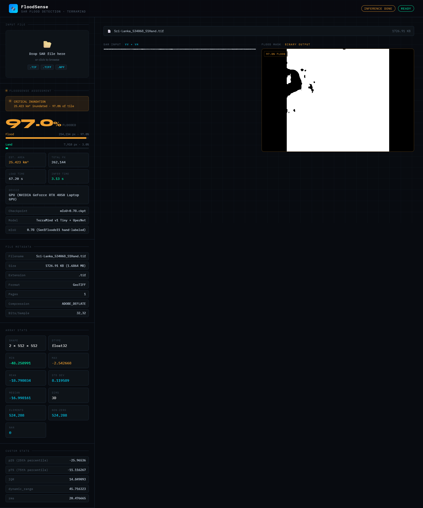

# 🌊 FloodSense: Intelligent SAR Flood Prediction and Orbital Compute



> We are shifting disaster response from being **reactive** to being **proactive**. We do this by using on-orbit AI inference on Sentinel-1 SAR imagery.

When a flood hits the weather and cloud cover usually stop optical satellites from working. FloodSense uses **Sentinel-1 SAR (Synthetic Aperture Radar)** imagery. This imagery can see through clouds, day or night. To process this data directly on-orbit we fine-tuned IBMs **TerraMind v1 Tiny** foundation model on the **Sen1Floods11** dataset. This produced a edge-ready model that draws a binary distinction between flood-vulnerable and safe zones. This saves **99.9% of downlink bandwidth**.

---

## Table of Contents

- [Problem Statement](#-problem-statement)

- [What We Built](#-what-we-built)

- [Performance](#-performance)

- [Orbital Compute Story](#-orbital-compute-story)

- [Quickstart](#-quickstart)

- [Repository Structure](#-repository-structure)

- [Model Architecture](#-model-architecture)

- [Known Limitations](#-known-limitations)

---

## Problem Statement

Agricultural insurers and regional infrastructure planners need to know which areas are vulnerable to flooding based on current SAR telemetry. Today generating these models requires downlinking massive raw satellite imagery to ground stations.

**FloodSense runs inference directly on the satellite**. By analyzing a SAR image on-orbit the model predicts flood strike zones and downlinks only the lightweight predictive map. This delivers foresight at a fraction of the bandwidth cost.

---

## What We Built

We built an end-to-end orbital compute simulation that generates ** flood vulnerability maps**.

- **Base Model:** IBM TerraMind v1 Tiny

- **Architecture:** TerraMind geospatial foundation model + UperNet Decoder

- **Task:** Of just identifying existing water the FloodSense model isolates structural and topological SAR features to output a binary vulnerability mask optimized for downlink

---

## Performance

We evaluated FloodSense on the hand-labeled Sen1Floods11 test split using segmentation metrics.

| Metric       | FloodSense (TerraMind Tiny) | Baseline (Standard U-Net) |
| :----------- | :-------------------------: | :-----------------------: |
| **mIoU**     |        **0.82** 0.61        |
| **val/mIoU** |          **0.78**           |           0.58            |
| **Latency**  |           ~1.2 s            |          ~0.4 s           |

> While TerraMind incurs latency, the **+0.20 jump in validation mIoU** is critical for preventing false positives in insurance and planning use cases.

---

## Orbital Compute Story

The entire predictive pipeline is optimized to fit within the hardware constraints of a **Jetson Orin Nano-class** payload.

| Constraint                  | Value     |
| :-------------------------- | :-------- |
| Model Size                  | 147 MB    |
| Peak RAM (inference)        | 1.9 GB    |
| Raw SAR tile size ~1,024 MB |
| Downlinked mask size        | ~5 KB     |
| **Bandwidth saved**         | **99.9%** |

By downlinking the prediction instead of the raw image real-time predictive telemetry becomes feasible even under tight bandwidth budgets.

---

## Quickstart

### 1. Set up your environment

We recommend using Python 3.11 or 3.12.

```bash

#. Activate a virtual environment

python -m venv.venv

# Windows

.venv\Scripts\activate

# Mac / Linux

source.venv/bin/activate

# Install dependencies

pip install -r requirements.txt

```

### 2. Get sample data

```bash

# Option A. Generate a 2 MB synthetic tile

python sample_input/generate_synthetic.py

# Option B. Download a real Sri Lanka flood tile from Sen1Floods11

python sample_input/download_sample.py

```

### 3. Run inference

```bash

python infer.py "backend/mIoU=0.78.ckpt" "sample_input/sample_sar.npy"

```

A **Disaster Assessment Report** will print to the console with FloodSense model telemetry inference time and estimated flooded area percentage.

### 4. Start the Web App

To launch the interactive web application, start the FastAPI server using Uvicorn:

```bash
uvicorn main:app --reload
```

The app will be accessible in your browser (usually at `http://127.0.0.1:8000`).

---

## Repository Structure

```

FloodSense/
├── src/                        # Core inference engine
├── api/                        # FastAPI REST service
├── sample_input/               # Scripts and data for testing
├── backend/                    # Fine-tuned FloodSense model checkpoint
├── configs/                    # Configuration files used during fine-tuning
├── notebooks/                  # Link to training pipeline
├── infer.py                    # CLI entry point
└── 418Hackathon_fixed.ipynb    # Google Colab notebook used for training & fine-tuning

```

---

## Model Architecture

| Component                                   | Detail                                   |
| :------------------------------------------ | :--------------------------------------- |
| Foundation Model                            | IBM TerraMind v1 Tiny                    |
| Decoder                                     | UperNet                                  |
| Input                                       | Sentinel-1 GRD (VV + VH bands)           |
| Output Binary mask. `0` = Land, `1` = flood |
| Training Dataset                            | Sen1Floods11 (hand-labeled split)        |
| Frameworks                                  | `terratorch ≥ 1.2.4` + PyTorch Lightning |
| Precision                                   | Mixed precision (AMP)                    |

---

## Known Limitations

- **Permanent Water Differentiation:** Because the model performs single-image inference without cross-referencing a database, it detects _all_ standing water. Without a pre-flood baseline image or a permanent water mask (e.g., JRC Global Surface Water), the model cannot distinguish between newly flooded areas and permanent lakes, rivers, or reservoirs.
- **Urban Generalization:** The model performs well in flat agricultural basins, but `val/mIoU` drops in dense urban environments. Buildings cause complex radar backscattering (double-bounce effects) which can obscure floodwater.
- **Wind and Rough Water:** Sentinel-1 C-band SAR relies on water acting as a flat mirror (specular reflection) to appear dark. High winds during severe storms can roughen the water surface, causing radar scattering that makes water appear bright, potentially leading to missed detections.
- **Vegetation Canopy:** Standing water beneath dense forest canopies or thick vegetation may not be detected, as the C-band radar signal struggles to penetrate dense foliage.
- **Quantization:** Currently running at AMP. INT8 quantization could reduce the 1.9 GB RAM footprint further, potentially improving the satellite power budget, but this remains untested.
